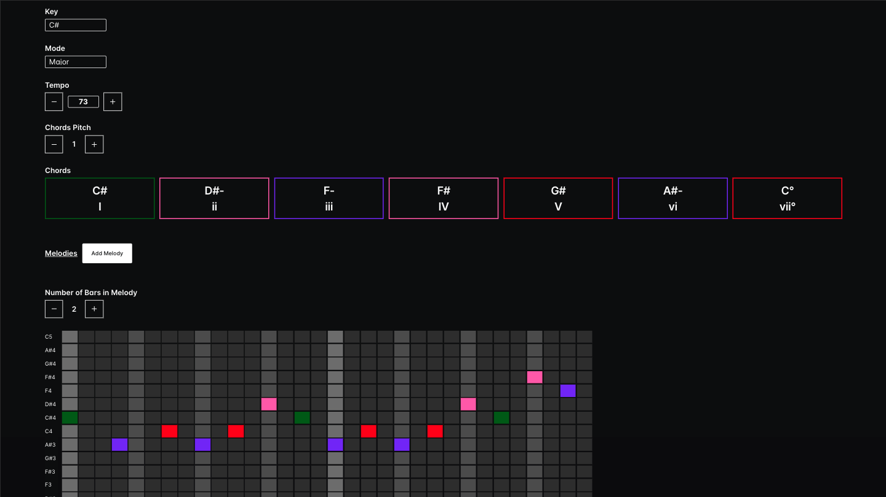

<div align="center">
  
</div>

<br>
<br>

# 🎼 Melody Builder

Frontend application for building beautiful Melodies on Piano. 🎹 ❤️ 🎹 ❤️

## Overview

Melody Builder is a visually intuitive and interactive tool for composing, editing, and managing melodies using a step-sequencer interface. Designed with Chakra UI and built in React/TypeScript, it empowers musicians and hobbyists alike to shape musical ideas effortlessly—right in the browser.

The core interface features a piano roll, chord timeline, and dynamic controls for tempo, pitch, scale, and more—all fully customizable and responsive.

## Key Features:

-   🎵 Piano Roll Sequencer: Step-based melody input with adjustable resolution and real-time playback.

-   🧠 Smart Note Grid: Performance-optimized grid interactions using useRef and memoized cells for lag-free editing, even during playback.

-   🎹 Scale + Mode Selector: Dynamically set the musical key and mode to guide your composition.

-   ⏱️ Tempo Control: Adjust the beats per minute with smooth animation sync and metronome support.

-   🔉 Sample-Based Audio Playback: Preloaded note buffers enable instant, high-quality playback on click and in loop.

-   🎼 Chord Timeline: Manage harmonic progression in sync with your melody.

-   🔁 Playback & Scheduler: Beat-accurate scheduler with visual playhead animation.

-   🖱️ Interactive Cells: Click to toggle notes, with visual feedback and dynamic brightness based on position in the bar.

-   🌗 Light/Dark Mode Support: Toggle UI themes using Chakra’s ColorModeToggle component.

-   🗂️ Project Manager: Save/load melody configurations as JSON, making collaboration and sharing simple.

-   📏 Note Cell Sizer: Adjust the visual size of each note cell using a Chakra slider.

-   🧰 Accessible, Responsive UI: Built with Chakra UI for clean visuals and keyboard-friendly interaction.

## Tech Stack

-   **Framework**: React.js && chakra-ui
-   **Language**: TypeScript
-   **Styling**: Tailwind CSS v4 with custom design system
-   **State Management**: useContext

## Prerequisites

-   Node.js >= 18
-   npm or similar package manager

## Installation

### Local Development Setup

1. **Clone the Repository**

    ```bash
    git clone https://github.com/JakobSaw/melody-builder
    cd melody-builder
    ```

2. **Install Dependencies**

    ```bash
    npm install
    ```

## Running the Project

To start a local development server:

```bash
npm run dev
```

The application will be available at `http://localhost:5173`.

### Other Development Commands

```bash
npm run build        # Build for production
npm run start        # Start production server
npm run lint         # Run ESLint
```

## Development

### Code Standards

-   **TypeScript**: Strict mode enabled with comprehensive type checking
-   **ESLint**: Extended Next.js configuration with custom rules
-   **Prettier**: Consistent code formatting

### Adding New Features

1. Create feature branch from `main`
2. Implement changes with proper TypeScript typing
3. Test locally
4. Create pull request to `main` branch

## Contributing

Before you create a pull request, write an issue so we can discuss your changes.

## Contributors

Thanks goes to these wonderful people ([emoji key](https://allcontributors.org/docs/en/emoji-key)):

<!-- ALL-CONTRIBUTORS-LIST:START - Do not remove or modify this section -->
<!-- prettier-ignore-start -->
<!-- markdownlint-disable -->
<table>
  <tbody>
    <tr>
      <td align="center" valign="top" width="14.28%"><a href="https://github.com/JakobSaw"><br /><sub><b>Jakob S.</b></sub></a><br />💻 ❤️ 🎹</td>
    </tr>
  </tbody>
</table>

<!-- markdownlint-restore -->
<!-- prettier-ignore-end -->

<!-- ALL-CONTRIBUTORS-LIST:END -->

This project follows the [all-contributors](https://github.com/all-contributors/all-contributors) specification. Contributions of any kind welcome!

## Content Licensing

Texts and content available as [CC BY](https://creativecommons.org/licenses/by/3.0/de/).

## Credits

© 2025 - JakobSaw
